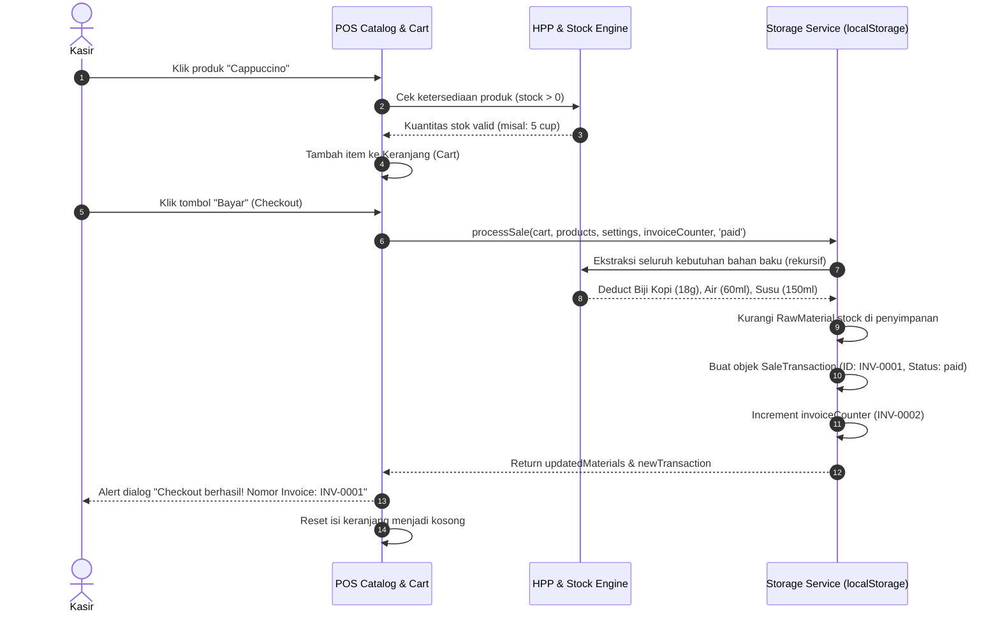
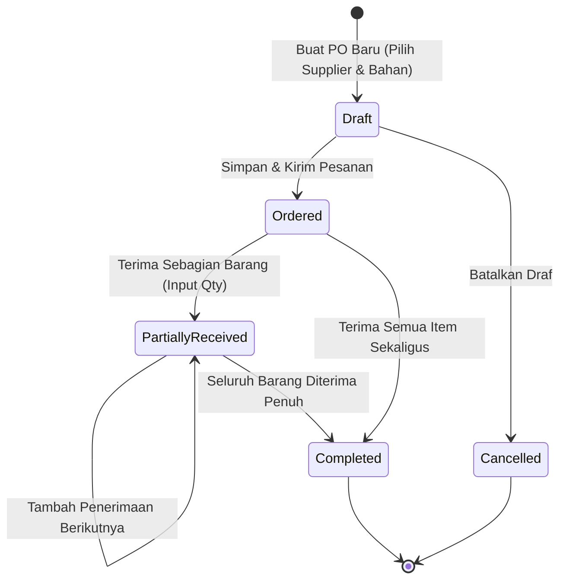

# DOKUMENTASI FORENSIK & EKSTRAKSI DNA APLIKASI
**Proyek Artefak:** Loja-62 — F&B Point of Sale & Recipe-Based Manufacturing Inventory System  
**Metode Analisis:** *Full-Stack Static Code Forensic, Architectural Reverse-Engineering, & UX/UI Deconstruction*  
**Environment Asal:** Google AI Studio (Vite + React 19 + TypeScript + Tailwind CSS)  
**Target Kompatibilitas:** Antigravity Engine / Standalone Production Full-Stack

---

# PART 1 — APPLICATION IDENTITY

### Application Name
**Loja-62** *(Ditemukan eksplisit pada `metadata.json`, `constants.ts`, `services/api.ts`, dan tag `<title>` di `index.html`)*.

### Working Name
*Loja-62 F&B Micro-Manufacturing & Recipe-Driven POS Engine*

### One-Line Definition
Aplikasi Point of Sale (POS) dan manajemen operasional bisnis F&B/ritel mikro berbasis web yang secara otomatis menghubungkan transaksi kasir, kalkulasi HPP (Harga Pokok Penjualan) multi-level berbasis resep (Bill of Materials), persediaan bahan baku real-time, pengadaan supplier (Purchase Orders), penyesuaian stok, serta pelacakan aset dan depresiasi.

### Short Description
**Loja-62** dirancang khusus untuk mengatasi kesenjangan kritis dalam operasional bisnis makanan dan minuman (F&B), kedai kopi (coffee shop), dan *artisan bakery*. Berbeda dengan sistem kasir konvensional yang hanya mencatat pengurangan kuantitas produk jadi 1:1, Loja-62 memperlakukan produk sebagai hasil perakitan manufaktur (*manufacturing assembly*). Setiap kali secangkir kopi atau sepotong roti terjual, sistem secara otomatis menghitung dan memotong gramatur bahan baku mentah dari inventaris berdasarkan formula resep yang telah didefinisikan.

Sistem ini mengintegrasikan struktur resep bertingkat (*nested/sub-product recipes*), seperti pembuatan bahan setengah jadi (misalnya *espresso shot*) yang dapat digunakan sebagai komponen dasar bagi produk akhir (*cappuccino* atau *iced latte*). Di saat yang sama, Loja-62 mengkalkulasi HPP dinamis (*Cost of Goods Sold*) yang menggabungkan harga bahan baku terkini, estimasi upah tenaga kerja langsung (*direct labor*), dan biaya overhead produksi (*overhead cost*) untuk menghasilkan angka margin laba bersih yang presisi pada setiap transaksi kasir.

Selain kasir dan resep, aplikasi menyediakan modul ekosistem operasional menyeluruh: Pengadaan Barang (*Purchase Orders*) dengan alur penerimaan bertahap (*receiving workflow*), pencatatan limbah dan susut (*Stock Adjustment/Wastage*), buku kontak pelanggan dan pemasok, pembuatan faktur tempo/kredit (*unpaid invoice*), riwayat penjualan dengan filter temporal, dashboard analisis metrik harian, manajemen aset tetap toko dengan estimasi penyusutan (*straight-line depreciation*), serta dukungan bilingual penuh (Bahasa Indonesia & Bahasa Inggris).

### Product Category
*Point of Sale (POS) / F&B Micro-ERP & Recipe Inventory Management System*

### Primary User
* **Pemilik Bisnis F&B Mikro/Kecil (Owner-Operator):** Coffee shop, bakery, katering rumahan, atau gerai minuman kekinian yang memproduksi sendiri produk yang dijualnya.
* **Barista / Kasir:** Staf garis depan yang mengoperasikan layar pemesanan, memilih produk, mengelola keranjang, dan memproses pembayaran tunai atau pembuatan faktur.
* **Manajer Operasional / Gudang:** Penanggung jawab yang memantau stok bahan mentah, menginput pesanan pembelian (*Purchase Order*) ke supplier, menerima kiriman bahan, dan mencatat bahan terbuang (*spillage/spoilage*).

### Primary Job To Be Done (JTBD)
> *"Ketika saya menjalankan kedai kopi/bakery, saya ingin sistem kasir yang secara otomatis memotong stok bahan baku berdasarkan takaran resep dan menghitung margin laba bersih aktual dari setiap menu yang terjual, sehingga saya tidak mengalami kebocoran bahan baku dan mengetahui profitabilitas operasional tanpa perhitungan manual yang rumit."*

### Core Problem
1. **Ketidaksesuaian Model Stok Ritel vs F&B:** Sistem POS ritel standar mengasumsikan produk dibeli dan dijual dalam bentuk fisik yang sama (stok barang = 1 botol). Pada industri F&B, produk yang dijual (misal *Croissant*) tidak disimpan sebagai stok tunggal, melainkan gabungan dari telur, tepung, mentega, dan gula.
2. **Ketiadaan Visibilitas HPP Dinamis:** Pelaku usaha F&B skala UMKM jarang mengetahui HPP riil produknya karena harga bahan mentah fluktuatif serta adanya biaya tenaga kerja langsung dan operasional listrik/gas (*overhead*) yang tidak pernah dimasukkan ke dalam perhitungan kasir.
3. **Pencatatan Limbah & Pembelian Terfragmentasi:** Stok berkurang bukan hanya karena terjual, melainkan tumpah, basi (*wastage*), atau dikonsumsi staf (*internal use*). Tanpa sistem adjustment terintegrasi, catatan inventaris cepat menjadi tidak akurat.

### Core Value
* **BOM (Bill of Materials) Otomatis:** Perhitungan stok virtual dinamis (*virtual stock level*) yang membatasi pesanan kasir berdasarkan ketersediaan bahan baku paling kritis (*bottleneck material*).
* **Multi-Tier Recipe Support:** Mendukung produk setengah jadi (*semi-finished goods*) sebagai bahan dasar resep produk jadi lainnya.
* **Profit Visibility per Transaksi:** Setiap struk/invoice mencatat total penerimaan, subtotal, pajak, total HPP modal, dan laba kotor secara instan.
* **Siklus Hidup Pembelian Lengkap:** Dari draf PO $\rightarrow$ pesanan terkirim $\rightarrow$ penerimaan barang parsial/penuh $\rightarrow$ penambahan stok bahan baku otomatis.

### Product Intent *(Inferred & Explicit)*
* **Eksplisit:** Dibangun sebagai Progressive Web App (PWA) modern, offline-first (disimpan di browser via `localStorage`), berkinerja cepat dengan antarmuka gelap (*dark slate theme*) bergaya "Aurora UI".
* **Tersirat (Inferred):** Ditujukan untuk operasional independen satu gerai (*single-store standalone*) tanpa kebergantungan server cloud yang mahal, memberikan kemampuan pencatatan kelas ERP dengan kemudahan pemakaian kasir tablet/laptop.

---

# PART 2 — PRODUCT MODEL & MENTAL MODEL

## Mental Model Aplikasi
Aplikasi ini beroperasi menggunakan analogi **"Dapur Produksi Terhubung Kasir"** (*Kitchen-to-Register Pipeline*):
```
[ Bahan Baku Mentah ] ──(diolah via Resep)──> [ Produk Setengah Jadi ]
         │                                               │
         └───(dikombinasikan via Resep + Tenaga Kerja)───┴──> [ Produk Jadi ]
                                                                   │
                                                            (Dijual di Kasir)
                                                                   │
                                                ┌──────────────────┴──────────────────┐
                                                ▼                                     ▼
                                      [ Pengurangan Stok Bahan ]             [ Transaksi & Profit ]
```

## Objek Utama di Dalam Sistem & Relasi Entitas
1. **RawMaterial (Bahan Baku):**
   * Atribut: `id`, `name`, `categoryId`, `stock`, `unit` (`gram` | `ml` | `pcs`), `costPerUnit`, `supplierId`.
   * Peran: Aset inventaris dasar yang dihitung dalam satuan fisik.
2. **Product (Produk):**
   * Atribut: `id`, `name`, `categoryId`, `recipe` (`RecipeItem[]`), `sellPrice`, `imageUrl`, `directLaborCost`, `productionOverheadCost`.
   * Catatan Penting: Jika `sellPrice === 0`, sistem memperlakukannya sebagai **Produk Setengah Jadi** (*Semi-Finished Product*), yang tidak muncul di katalog POS kasir tetapi tersedia sebagai bahan resep produk lain.
3. **RecipeItem (Elemen Formula):**
   * Polimorfik: Menghubungkan Produk ke `raw-material` ATAU ke `product` lain dengan bobot `quantity`.
4. **SaleTransaction (Transaksi Kasir):**
   * Snapshot data: Menyimpan `items` (lengkap dengan harga jual dan snapshot `hpp` pada saat transaksi), `subtotal`, `tax`, `total`, `totalHpp`, `profit`, `paymentStatus` (`paid` | `unpaid`), dan opsional `customerId`.
5. **PurchaseOrder (Pesanan Pembelian):**
   * Siklus hidup status: `draft` $\rightarrow$ `ordered` $\rightarrow$ `partially-received` $\rightarrow$ `completed` (atau `cancelled`).
6. **StockAdjustment (Koreksi & Limbah):**
   * Tipe mutasi: `wastage` (sampah/basi), `correction` (koreksi opname), `internal-use` (konsumsi barista/dapur), `return` (retur supplier).
7. **StoreAsset (Aset Toko):**
   * Pelacak kapitalisasi mesin espresso, oven, grinder: `purchasePrice`, `residualValue`, `usefulLife`.

## Conceptual Flow State Transition
```text
USER (Kasir)
  │
  ├─> ACTION: Memilih "Cappuccino" (qty: 2) & Klik Checkout
  │     │
  │     ▼
  ├─> ENGINE PROCESSING (Virtual Resolution):
  │     1. Evaluasi Resep Cappuccino:
  │        - Butuh: 2 x (1 Espresso Shot + 150ml Susu Segar)
  │        - Sub-Evaluasi Resep Espresso Shot:
  │          - Butuh: 2 x 1 x (18g Biji Kopi Arabika + 60ml Air Mineral)
  │     2. Total Kebutuhan Bahan:
  │        - Biji Kopi Arabika: 36 gram
  │        - Air Mineral: 120 ml
  │        - Susu Segar: 300 ml
  │     3. Verifikasi Stok: Cek ketersediaan stok fisik setiap bahan.
  │
  ├─> STATE CHANGE:
  │     - RawMaterial.stock[Biji Kopi] -= 36
  │     - RawMaterial.stock[Air]       -= 120
  │     - RawMaterial.stock[Susu]      -= 300
  │     - SalesHistory.append(newTransaction)
  │     - InvoiceCounter += 1
  │
  └─> RESULT:
        - Alert modal "Checkout berhasil! Nomor Invoice: INV-XXXX"
        - Keranjang kembali kosong
        - Dashboard metrik pendapatan, laba, & grafik stok ter-update instan
```

---

# PART 3 — FEATURE INVENTORY

| Feature Name | Purpose | User Need | Trigger | Input | Processing | Output / State Change | Importance |
| :--- | :--- | :--- | :--- | :--- | :--- | :--- | :--- |
| **POS Grid & Catalog** | Memilih produk untuk dijual | Menampilkan katalog menu dengan foto, harga, dan ketersediaan | Navigasi ke view `pos` | Klik tombol kategori / scroll produk | Filter produk dengan `sellPrice > 0` dan mencocokkan `categoryId` | Menampilkan grid kartu produk dengan indikator stok aktual | **CORE** |
| **BOM Virtual Stock Calculation** | Menghitung kapasitas produksi riil | Mencegah kasir menjual menu yang bahan bakunya sudah habis | Render kartu produk / perubahan bahan | Koleksi resep & stok bahan baku mentah | Algoritma rekursif mencari batas terendah (*bottleneck*): $\min(\lfloor \text{stok} / \text{takaran} \rfloor)$ | Properti `product.stock`, penonaktifan tombol beli jika $0$ | **CORE** |
| **Recursive HPP Engine** | Menghitung harga pokok per menu | Mengetahui modal riil produk sebelum menetapkan harga jual | Render produk / form produk | `recipe`, `costPerUnit`, `directLaborCost`, `productionOverheadCost` | Rekursi hierarki resep dengan deteksi *circular dependency* menggunakan `Set<number>` | Nilai `product.hpp`, `product.materialCost`, dan margin laba kotor | **CORE** |
| **Cart & Multi-Action Checkout** | Menampung pesanan & penyelesaian transaksi | Menyelesaikan transaksi lunas kasir atau pembuatan faktur tempo | Klik produk di katalog POS | Tambah/kurang kuantitas, hapus item | Validasi batas stok, kalkulasi subtotal + pajak (`taxRate`%) | Transaksi tersimpan bertipe `paid`, pemotongan stok bahan | **CORE** |
| **Credit Invoice Generation** | Membuat invoice piutang untuk pelanggan | Menagih pelanggan bisnis / langganan secara berkala | Tombol *"Buat Invoice"* di Cart | Pemilihan `customerId` dari modal | Validasi keranjang, membuat invoice status `unpaid` | Transaksi `unpaid` tersimpan, pengurangan stok bahan seketika | **SUPPORTING** |
| **Bill of Materials Recipe Builder** | Meracik formula bahan baku & biaya overhead | Mendefinisikan komposisi resep dan struktur biaya per produk | Modal Product Form | Bahan mentah / produk setengah jadi + kuantitas, labor, overhead | Penyusunan array `RecipeItem[]` | Objek `Product` tersimpan di `localStorage` | **CORE** |
| **Raw Material Master** | Manajemen stok & harga dasar bahan mentah | Mengontrol stok fisik, satuan ukur (gram/ml/pcs), dan supplier | Tab *"Bahan Baku"* | Nama, kategori, stok awal, unit, harga beli, supplier | Validasi relasi supplier & kategori | Data bahan mentah terdaftar di sistem | **CORE** |
| **Purchase Order (PO) Lifecycle** | Pengadaan bahan baku ke supplier | Mengirim pesanan resmi dan memantau kedatangan barang | Tab *"Pesanan Pembelian"* | Supplier, estimasi tiba, daftar item, harga beli disepakati | Status transitions: `draft` $\rightarrow$ `ordered` $\rightarrow$ `partially-received` $\rightarrow$ `completed` | Generate dokumen PO (`PO-0001`), perhitungan total biaya | **SUPPORTING** |
| **Goods Receiving Modal** | Penerimaan kiriman barang dari supplier | Memasukkan barang masuk ke gudang secara bertahap atau penuh | Tombol *"Terima"* pada tabel PO | Kuantitas diterima per item | Menambah `RawMaterial.stock` sejumlah barang yang diterima | Perubahan stok gudang & status PO otomatis | **SUPPORTING** |
| **Stock Adjustments & Wastage** | Rekonsiliasi fisik & pencatatan limbah | Mencatat bahan tumpah, basi, konsumsi internal, atau stok opname | Tombol FAB di tab Penyesuaian | Tipe mutasi, alasan/catatan, daftar bahan + selisih qty | Memvalidasi agar stok akhir tidak bernilai negatif | Log mutasi stok dengan ID unik `ADJ-0001`, update stok bahan | **SUPPORTING** |
| **Sales History & Reporting** | Menganalisis riwayat dan filter transaksi | Melihat omset, laba bersih, filter rentang tanggal, dan cetak invoice | Tab *"Laporan"* | Filter waktu (All, Today, 7 Days, 30 Days, Custom Date) | Agregasi data transaksi penjualan | Tabel transaksi, modal detail faktur kasir, cetak struk | **SUPPORTING** |
| **Store Asset Depreciation Tracker** | Pengelolaan aset tetap & beban penyusutan | Mengetahui nilai sisa aset toko (mesin, interior) seiring waktu | Tab *"Aset Toko"* | Nama aset, tanggal beli, harga beli, nilai residu, umur ekonomis | Metode garis lurus (*straight-line depreciation*) | Daftar aset dengan rincian biaya modal | **OPTIONAL** |
| **Bilingual Language Switcher** | Beralih bahasa antarmuka (ID $\leftrightarrow$ EN) | Mendukung kasir atau staf berbahasa Inggris/Indonesia | Tombol toggle di Header kanan atas | Klik tombol `ID` atau `EN` | `LanguageContext` memperbarui `localStorage('locale')` | Seluruh label UI, notifikasi, dan konfirmasi berganti seketika | **SUPPORTING** |
| **Store & Invoice Customization** | Konfigurasi identitas toko, logo, dan footer struk | Mempersonalisasi bukti bayar & perhitungan pajak | Tab *"Profil Toko"* & *"Pengaturan Invoice"* | Nama toko, logo URL, alamat, tarif PPN (%), simbol mata uang, prefix | Penyimpanan konfigurasi global `AppSettings` | Tampilan header, struk kasir, dan perhitungan kalkulator | **SUPPORTING** |

---

# PART 4 — USER JOURNEYS & INTERACTION FLOWS

### 1. Primary Flow: Transaksi Penjualan Tunai di Kasir (POS Direct Sale)


### 2. Secondary Flow: Alur Pengadaan Barang & Penerimaan Bertahap (PO & Receiving)

* **State Behavior:** Setiap kali item diterima pada modal *Receive PO*, `RawMaterial.stock` secara otomatis bertambah secara real-time sejumlah kuantitas yang diterima, tanpa menunggu PO berstatus *Completed*.

### 3. Error Recovery Flow: Pencegahan Penghapusan Data Terikat (*Referential Integrity Protection*)
Aplikasi menerapkan integritas referensial berbasis proteksi penghapusan manual:
* **Kasus:** Pengguna mencoba menghapus bahan mentah *"Biji Kopi Arabika"*.
* **Pendeteksian:** `api.deleteRawMaterial()` memeriksa apakah terdapat `Product` yang di dalam `recipe`-nya mengandung `itemId === rawMaterialId`.
* **Respon Sistem:** Membatalkan aksi dan melempar error terlokalisasi: `t('errorDeleteRawMaterialInRecipe')` (*"Bahan baku ini tidak dapat dihapus karena masih digunakan dalam resep produk"*).
* **Pemulihan (Recovery):** Pengguna diarahkan untuk mengubah resep produk terkait terlebih dahulu sebelum dapat menghapus bahan baku tersebut.

---

# PART 5 — INFORMATION ARCHITECTURE

```text
LOJA-62 ROOT APPLICATION
├── HEADER (Top Navigation & Brand Identity)
│   ├── Brand Info (StoreIcon, Store Name [default: 'Loja-62'])
│   ├── Language Switcher Toggle (ID | EN)
│   └── Main Navigation Bar
│       ├── [Button] POS (Kasir Langsung)
│       ├── [Dropdown] Produk
│       │   ├── Daftar Produk (Inventory)
│       │   ├── Kategori Produk (Categories)
│       │   ├── Bahan Baku (Raw Materials)
│       │   ├── Kategori Bahan (Raw Material Categories)
│       │   ├── Pesanan Pembelian (Purchase Orders)
│       │   └── Penyesuaian Stok (Stock Adjustments)
│       ├── [Dropdown] Kontak
│       │   ├── Customer
│       │   └── Supplier
│       ├── [Button] Dashboard (Ringkasan Metrik Harian)
│       ├── [Button] Laporan (Riwayat Penjualan)
│       └── [Dropdown] Manajemen
│           ├── Profil Toko (Store Profile Settings)
│           ├── Aset Toko (Store Assets & Depreciation)
│           └── Pengaturan Invoice (Prefix & Footer)
│
├── MAIN WORKSPACE (Dynamic View Container)
│   ├── View: 'pos'
│   │   ├── Left Column (2/3): CategoryTabs Bar + ProductCard Grid
│   │   └── Right Column (1/3): Sticky Cart Panel (Subtotal, Tax, Actions)
│   ├── View: 'inventory' ─────── Table Produk, HPP, Harga Jual, Laba Kotor, Stok
│   ├── View: 'categories' ────── Table Kategori Produk & Aksi Hapus/Edit
│   ├── View: 'materials' ─────── Table Bahan Baku, Supplier, Satuan, Harga Beli
│   ├── View: 'material-categories' Table Kategori Bahan Baku
│   ├── View: 'purchase-orders' ─ Table PO, Status Badge, Tombol Terima Barang
│   ├── View: 'stock-adjustments' Table Mutasi Stok, Tipe (Wastage/Correction/Return)
│   ├── View: 'customers' ─────── Table Pelanggan (Nama, Telepon, Email)
│   ├── View: 'suppliers' ─────── Table Pemasok (Nama, PIC, Kontak, Alamat)
│   ├── View: 'dashboard' ─────── 4 StatCards, Top 5 Products, Low Stock Alerts
│   ├── View: 'reports' ───────── Filter Temporal, Table Transaksi Kasir, Detail Action
│   ├── View: 'store-profile' ─── Form Data Bisnis, PPN %, Simbol Mata Uang
│   ├── View: 'invoice-settings' Form Pengaturan Nota (Prefix, Footer Struk)
│   └── View: 'store-assets' ──── Table Aset Fisik Toko, Nilai Residu, Umur
│
├── FLOATING ACTION BUTTON (Context-Aware FAB)
│   └── Lingkaran Gradien Ungu-Indigo di pojok kanan bawah (icon: +)
│       Menyesuaikan aksi modal berdasarkan `currentView` aktif secara otomatis.
│
└── GLOBAL MODAL SYSTEM (Single-Layer Backdrop Overlay)
    ├── ProductForm Modal (Detail Produk, Upload Foto, & Visual Recipe Builder)
    ├── RawMaterialForm Modal (Input Bahan Baku, Unit Satuan, Supplier)
    ├── CategoryForm & RawMaterialCategoryForm Modals
    ├── SupplierForm & CustomerForm Modals
    ├── PurchaseOrderForm Modal (Pembuatan PO & Item Dinamis)
    ├── ReceivePOModal (Checklist Penerimaan Parsial Gudang)
    ├── StockAdjustmentForm Modal (Pencatatan Selisih/Limbah Stok)
    ├── StoreAssetForm Modal (Input Aset & Masa Manfaat)
    ├── CreateInvoiceModal (Pilihan Customer untuk Penagihan Piutang)
    └── TransactionDetailModal (Preview Struk/Nota & Analisis Margin Laba)
```

---

# PART 6 — UI / UX ARCHITECTURE & PATTERNS

### Layout System & Spatial Grid
* **Struktur Kanvas:** Mengadopsi tata letak responsif bertingkat dengan batas lebar maksimum `max-w-screen-2xl mx-auto`.
* **Grid Kasir:** Pada layar besar (`lg`), menggunakan pembagian asimetris 2:1 (2 Kolom untuk pemilihan produk, 1 Kolom untuk Panel Kasir *Sticky* di sebelah kanan).
* **Dense Product Grid:** Menampilkan kartu produk dalam formasi 2 kolom pada perangkat mobile (`grid-cols-2`), 3 kolom pada tablet, dan 4 kolom pada desktop (`lg:grid-cols-4`).

### UX Pattern Matrix

| Pattern | Purpose | Behavior | Why It Matters |
| :--- | :--- | :--- | :--- |
| **Contextual Floating Action Button (FAB)** | Akselerasi input data entitas | Tombol FAB mengambang (`fixed bottom-8 right-8`) secara cerdas mengubah fungsi dan labelnya sesuai halaman aktif (misal: di tab Produk menjadi *"Tambah Produk"*, di tab Supplier menjadi *"Tambah Supplier"*). Tombol otomatis hilang pada tampilan POS, Dashboard, dan Laporan. | Mengurangi beban kognitif pengguna untuk mencari tombol *"Tambah"* di berbagai sudut layar. |
| **Dual Checkout Path** | Membedakan transaksi tunai langsung dan faktur tempo | Keranjang kasir menyediakan dua tombol berdampingan: tombol abu-abu *"Buat Invoice"* (memilih pelanggan untuk piutang) dan tombol gradien *"Bayar"* (penjualan tunai instan). | Sangat krusial bagi bisnis kafe/katering yang sering melayani pesanan *corporate* atau langganan kantor yang pembayarannya di akhir bulan. |
| **Visual Recipe Construction (BOM Builder)** | Membangun formula resep tanpa keahlian akuntansi | Pada modal produk, pengguna dapat memilih bahan mentah ATAU produk setengah jadi dari dropdown gabungan, memasukkan takaran, dan melihat kalkulasi estimasi HPP serta estimasi biaya bahan mentah yang ter-update seketika. | Mendemokratisasi penyusunan harga pokok F&B untuk pemilik usaha tanpa latar belakang akuntansi biaya. |
| **Click-Outside Dropdown Navigation** | Menata 14 sub-halaman dalam satu bilah navigasi ringkas | Menggunakan React `useRef` dan `mousedown` event listener untuk mendeteksi interaksi di luar menu dropdown (Produk, Kontak, Manajemen). | Menjaga header tetap rapi dan tidak memakan ruang vertikal layar kasir. |
| **Stock Scarcity Warning Affordance** | Mencegah kasir menjual produk yang bahan bakunya kosong | Jika resep suatu produk kekurangan bahan di gudang, kartu produk otomatis terlapisi overlay hitam transparan dengan badge *"Stok Habis"*, serta tombol keranjang beralih menjadi nonaktif (`cursor-not-allowed`). | Mencegah kesalahan kasir dalam menjanjikan menu yang tidak dapat diracik oleh barista/koki di dapur. |
| **Progressive Low Stock Bar** | Notifikasi visual stok menipis pada Dashboard | Menampilkan progress bar bahan mentah di bawah 50 unit. Bar berwarna kuning amber jika stok antara 20–50 unit, dan berubah menjadi merah jika di bawah 20 unit. | Memberikan sinyal visual darurat kepada manajer untuk segera membuat Pesanan Pembelian (*PO*) ke supplier. |

---

# PART 7 — VISUAL DNA

## 1. Color Palette (Aurora Dark Theme)
Aplikasi dibangun di atas palet modern berlatar belakang gelap bernuansa *Cool Slate* yang dipadukan dengan aksen ungu-indigo neon (*Aurora Palette*).

```text
SURFACE & BACKGROUNDS:
  ├── Canvas Background   : bg-gradient-to-br from-gray-900 (#111827) to-slate-900 (#0f172a)
  ├── Card / Panel Surface: bg-slate-800/50 (#1e293b dengan opacity 50% + backdrop-blur-sm)
  ├── Elevated Control    : bg-slate-700/80 (#334155)
  └── Sub-surface / Table : bg-slate-800/60 (#1e293b)

PRIMARY & ACCENT COLORS:
  ├── Brand Primary Accent: Purple / Indigo Gradient
  │   ├── Normal          : from-purple-600 (#9333ea) to-indigo-600 (#4f46e5)
  │   ├── Hover State     : from-purple-700 (#7e22ce) to-indigo-700 (#4338ca)
  │   └── Active Glow Pill: bg-purple-500/20 text-purple-300 (#d8b4fe)
  ├── Secondary Action    : bg-slate-700 (#334155) hover:bg-slate-600 (#475569)
  └── Focus Ring          : focus:ring-purple-500 (#a855f7)

TYPOGRAPHY & CONTENT:
  ├── Text Primary (Head) : text-slate-100 (#f1f5f9) - Kontras tertinggi
  ├── Text Body           : text-slate-200 (#e2e8f0) & text-slate-300 (#cbd5e1)
  ├── Text Muted / Labels : text-slate-400 (#94a3b8)
  └── Text Placeholder   : text-slate-500 (#64748b)

SEMANTIC & METRIC COLORS:
  ├── Success / Profit    : text-green-400 (#4ade80) | bg-green-500/10 | Badge: bg-green-600
  ├── Warning / Partial   : text-amber-400 (#fbbf24) | bg-amber-500/10 | Badge: bg-yellow-600
  ├── Danger / Out of Stock: text-red-400 (#f87171)   | bg-red-500    | Badge: bg-red-600
  └── Metric Info (Sky)   : text-sky-400 (#38bdf8)    | bg-sky-500/10
```

## 2. Typography
* **Font Family:** `font-sans` sistem operasi standar (Inter / Segoe UI / Apple System).
* **Scale & Hierarchy:**
  * **Brand Display / H1:** `text-2xl md:text-3xl font-bold tracking-tight text-slate-100`
  * **Section Header / H2:** `text-2xl font-bold text-slate-100`
  * **Card / Stat Value:** `text-2xl font-bold text-slate-100`
  * **Card Title / Subhead:** `text-lg font-bold text-slate-100` / `text-sm font-medium text-slate-400`
  * **Body & Table Text:** `text-sm text-slate-300` dengan line-height proporsional
  * **Badge & Microcopy:** `text-xs font-semibold uppercase tracking-wider`
* **Currency Formatting:** Menggunakan standar lokal Indonesia `new Intl.NumberFormat('id-ID')` yang menghasilkan format seragam: `Rp 25.000`.

## 3. Spacing, Borders & Radius Rules
* **Container Padding:** Standar padding panel kartu adalah `p-6` (24px) dengan radius sudut `rounded-xl` (12px).
* **Divider & Border:** Garis pemisah halus menggunakan `border border-slate-700/50` atau `border-b border-slate-700`.
* **Form Inputs:** Input teks dan angka dirancang tinggi seragam dengan padding `px-3 py-2`, latar belakang `bg-slate-800`, dan border `border-slate-600 rounded-md`.
* **Interactive Controls:** Tombol primer kasir memiliki tinggi tap minimum 44px (`py-3`) untuk kenyamanan penggunaan layar sentuh pada perangkat tablet.

---

# PART 8 — TECHNICAL ARCHITECTURE & DATA LAYER

### Storage Engine: LocalStorage Key-Value Schema
Data disimpan secara offline di browser menggunakan `localStorage` melalui abstraksi helper di `services/api.ts`:

| Storage Key | Data Type | Skema Objek / Payload Utama |
| :--- | :--- | :--- |
| `products` | `Product[]` | `id, name, categoryId, recipe[], sellPrice, imageUrl, directLaborCost, productionOverheadCost` |
| `rawMaterials` | `RawMaterial[]` | `id, name, categoryId, stock, unit, costPerUnit, supplierId` |
| `categories` | `Category[]` | `id, name` |
| `rawMaterialCategories` | `RawMaterialCategory[]`| `id, name` |
| `salesHistory` | `SaleTransaction[]` | `id, timestamp, items[], subtotal, tax, total, totalHpp, profit, paymentStatus, customerId` |
| `suppliers` | `Supplier[]` | `id, name, contactPerson, phone, email, address` |
| `customers` | `Customer[]` | `id, name, phone, email` |
| `purchaseOrders` | `PurchaseOrder[]` | `id, supplierId, items[], status, orderDate, expectedDeliveryDate, receivedDate, totalCost, notes` |
| `stockAdjustments` | `StockAdjustment[]` | `id, date, type, items[{rawMaterialId, quantity, previousStock}], notes` |
| `storeAssets` | `StoreAsset[]` | `id, name, purchaseDate, purchasePrice, residualValue, usefulLife` |
| `appSettings` | `AppSettings` | `storeName, ownerName, tagline, storeType, address, city, province, logoUrl, taxRate, currencySymbol, invoicePrefix, invoiceFooter` |
| `invoiceCounter` | `number` | Counter numerik untuk membuat format faktur (cth: `1` $\rightarrow$ `INV-0001`) |
| `poCounter` | `number` | Counter numerik untuk format pesanan (cth: `1` $\rightarrow$ `PO-0001`) |
| `adjustmentCounter`| `number` | Counter numerik untuk mutasi stok (cth: `1` $\rightarrow$ `ADJ-0001`) |
| `locale` | `'en' \| 'id'` | Bahasa aktif aplikasi |

### Core Algorithms
#### 1. Recursive HPP / Cost of Goods Sold Engine (Bypass Circular Dependency)
```typescript
const calculateHpp = (product: Product, visited: Set<number> = new Set()): number => {
    if (visited.has(product.id)) {
        console.error("Circular dependency detected in recipes for product:", product.name);
        return Infinity; // Mencegah stack overflow
    }
    if (hppCache.has(product.id)) return hppCache.get(product.id)!;

    visited.add(product.id);
    const materialCost = product.recipe.reduce((total, item) => {
        if (item.itemType === 'raw-material') {
            const material = getRawMaterialById(item.itemId);
            return total + (material ? material.costPerUnit * item.quantity : 0);
        } else {
            const subProduct = getProductById(item.itemId);
            return total + (subProduct ? calculateHpp(subProduct, new Set(visited)) * item.quantity : 0);
        }
    }, 0);
    visited.delete(product.id);

    const totalHpp = materialCost + (product.directLaborCost || 0) + (product.productionOverheadCost || 0);
    hppCache.set(product.id, totalHpp);
    return totalHpp;
};
```

#### 2. Virtual Stock Resolution Engine (Bottleneck Formulation)
Kapasitas produksi suatu menu ditentukan oleh bahan baku yang memiliki rasio ketersediaan paling sedikit:
$$\text{Product Stock} = \min_{i \in \text{Recipe}} \left( \left\lfloor \frac{\text{Available Stock}_i}{\text{Required Quantity}_i} \right\rfloor \right)$$

---

# PART 9 — APPLICATION DNA & FORENSIC MIGRATION BLUEPRINT

Ketika memigrasikan atau merekonstruksi Loja-62 dari Google AI Studio ke environment development lain (seperti Antigravity Engine, Next.js, Electron, atau Flutter), gunakan klasifikasi triase berikut:

### 1. CORE (Identitas Murni — HARUS Dipertahankan)
1. **The Recipe-Inventory-POS Coupling:** Kasir tidak pernah mengurangi stok menu jadi; kasir selalu memicu deduksi bahan mentah di belakang layar secara rekursif.
2. **Semi-Finished Good Paradigm:** Produk dengan `sellPrice === 0` bertindak sebagai *assembly intermediate* (misal: Espresso Shot, Adonan Dasar, Saus Karamel).
3. **Tripartite Cost Structure:** HPP tidak hanya bahan mentah, melainkan penjumlahan dari: $\text{Bahan} + \text{Tenaga Kerja Langsung} + \text{Overhead Pabrikasi}$.
4. **Unified Procurement & Receiving:** PO memiliki siklus penerimaan mandiri yang langsung merefleksikan stok bertambah seketika barang ditandai tiba.
5. **Dua Opsi Pembayaran di Kasir:** Kemampuan memilih antara pelunasan tunai instan (*Paid Cash Sale*) atau penerbitan faktur piutang pelanggan (*Unpaid Invoice*).
6. **Bilingual Native Locale:** Aksesibilitas bahasa ganda Indonesia/Inggris.

### 2. IMPLEMENTATION (Dapat Disesuaikan / Di-refactor)
1. **Storage Persistence:** Saat ini menggunakan browser `localStorage`. Pada migrasi ke sistem multi-kasir/multi-cabang, layer ini dapat diganti dengan PostgreSQL, SQLite (via Dexie/WatermelonDB untuk offline sync), atau Supabase/Firestore tanpa mengubah UI/Mental Model.
2. **Global State Layer:** Saat ini dikelola via `useState` di root `App.tsx` dan diteruskan via props (*prop drilling*). Dapat direfaktor menggunakan Zustand atau React Query.
3. **Tailwind via CDN:** Di `index.html`, Tailwind dimuat dari CDN script. Pada environment modern, ini harus diganti dengan PostCSS / Tailwind CLI bawaan bundler.
4. **Alert & Confirm Dialogs:** Pemanggilan `window.alert()` dan `window.confirm()` sebaiknya diganti dengan komponen Toast & Modal konfirmasi kustom.

### 3. INCIDENTAL (Artefak Implementasi — Boleh Dihapus/Diganti)
1. **Unused File Artifact:** Terdapat file kosong `/components/Reports.tsx` berukuran 0 byte yang tidak digunakan, karena fungsi laporan sebenarnya dijalankan oleh `/components/SalesHistory.tsx`. File ini aman dihapus saat migrasi.
2. **Mock Image Seeds:** Penggunaan URL gambar `https://picsum.photos/seed/...` hanya merupakan fallback visual sementara.
3. **Threshold Stok Rendah 50:** Ambang batas stok tipis di Dashboard yang dipatok statis pada angka 50 unit (seharusnya di masa depan dapat dikonfigurasi per item, misalnya *reorder point* spesifik).

---

### Kesimpulan Forensik
Loja-62 bukan sekadar aplikasi kasir pencatat struk, melainkan **mesin otomasi kalkulasi biaya dan bahan baku (BOM Engine) skala mikro**. Kekuatan terbesarnya terletak pada kesederhanaan operasional bagi kasir di garis depan, yang ditopang oleh perhitungan rekursif presisi di lini belakang untuk menjaga margin laba dan akurasi persediaan bahan baku.

---

# PART 10 — FUTURE DEVELOPMENT ROADMAP: ROASTERY DOMAIN & MARKETPLACE INTEGRATION

Bagian ini mendokumentasikan hasil evaluasi kebutuhan ekspansi bisnis riil (khususnya industri *Coffee Roastery*) dan rencana transformasi aplikasi menjadi platform multi-channel / marketplace.

---

## 1. Roastery Domain-Specific Extensions

### A. Batch Roasting Work Order (Manufaktur Batch Fisik)
* **Kebutuhan:** Berbeda dengan pemotongan bahan *on-demand/just-in-time*, roastery memproses *green beans* menjadi *roasted beans* dalam *batch* besar (misal 5–10 kg per sesi sangrai).
* **Solusi Rencana:**
  * Modul **"Siklus Sangrai" (*Roasting Batch Order*)**: Pengguna memilih *Green Beans*, menginput berat mentah, berat matang (*yield*), dan sistem secara otomatis menghitung *Weight Loss Percentage* (biasanya 14–20%).
  * Sistem memotong stok *Green Beans* dan menambahkan stok fisik *Roasted Beans* ke inventaris gudang secara langsung.

### B. Multi-Unit of Measurement (UoM) Conversion
* **Kebutuhan:** Roastery membeli bahan dalam satuan karung (*grain sack* = 60 kg) atau karton, namun meracik menu dalam satuan gram dan mililiter.
* **Solusi Rencana:** Tabel konversi satuan otomatis pada master bahan baku:
  $$\text{1 Karung} = 60\ \text{kg} = 60.000\ \text{gram}$$

---

## 2. Marketplace & E-Commerce Integration Roadmap

Untuk mengubah Loja-62 dari kasir lokal gerai (*single-device offline POS*) menjadi toko online/marketplace publik terintegrasi, pengembangan dibagi dalam 4 fase strategis:

```text
┌─────────────────────────────────────────────────────────────────────────────┐
│                       ROADMAP EVOLUSI MARKETPLACE                           │
└─────────────────────────────────────────────────────────────────────────────┘
  FASE 1: CLOUD DATA SYNC
  ├── Migrasi `services/api.ts` dari `localStorage` ke Cloud DB (PostgreSQL / Supabase)
  └── Multi-device real-time sync antara laptop kasir dan pembeli online

  FASE 2: ROLE-BASED ACCESS CONTROL (RBAC) & ROUTE SEPARATION
  ├── Pemisahan rute privat: `/admin` & `/pos` (dilindungi autentikasi kasir/owner)
  ├── Pemisahan rute publik: `/shop` atau `/marketplace`
  └── Sanitasi data publik: Menyembunyikan HPP, supplier, kontak pelanggan lain, dan margin laba

  FASE 3: PUBLIC STOREFRONT & CHECKOUT
  ├── Etalase publik bersih (branding roastery, profil rasa/notes kopi, varian beans/ground)
  ├── Keranjang belanja online pembeli
  ├── Form checkout: Nama, WhatsApp, Alamat Pengiriman
  └── Integrasi "Quick Checkout via WhatsApp" & Notifikasi Pesanan Masuk

  FASE 4: PAYMENT GATEWAY & LOGISTICS ENGINE
  ├── Payment Gateway Otomatis (QRIS dinamis, Virtual Account, E-Wallet)
  ├── Shipping Calculator (Kalkulasi bobot gramatur pesanan via API kurir JNE/J&T/GoSend)
  └── State Machine Pesanan Online:
      `Unpaid` ──> `Paid` ──> `Roasting/Packing` ──> `Shipped (Resi)` ──> `Completed`
```

### Nilai Tambah Arsitektur: Unified Real-Time Inventory
Ketika pesanan marketplace online berhasil dibayar, mesin BOM Loja-62 secara otomatis memotong stok bahan baku mentah yang sama dengan yang digunakan oleh kasir offline di bar kopi, mengeliminasi risiko *overselling* (menjual produk yang stok fisiknya sudah habis).
